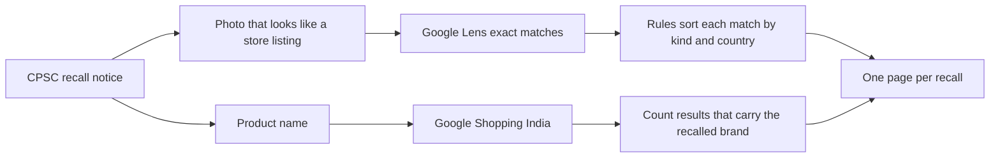

# Relisted

[](https://github.com/tanayvasishtha/Relisted/actions/workflows/ci.yml)
[](LICENSE)

Relisted finds store listings that match the photo from a US product recall notice, sorts them by country, and checks what a shopper in India finds when they search the product's name. Both searches run through SerpApi: Google Lens on the photo, Google Shopping India on the name.

[Live site](https://tanayvasishtha.github.io/Relisted/) · [Featured recall](https://tanayvasishtha.github.io/Relisted/recall.html?id=10579) · [How it works](https://tanayvasishtha.github.io/Relisted/method.html)


## What it found

The AiTuiTui pull-string teething toy was recalled in the US on 29 January 2026. The notice gives the reason as a risk of serious injury or death from choking, and says the toy was sold on Amazon.

One Lens search on the recall photo matched 400 or more pages. 117 of them are store listings, on 52 stores in 28 countries, and two are on Desertcart India. No listing title uses the name AiTuiTui. A search for the product's name on Google Shopping India shows 40 results from Flipkart, Amazon India, FirstCry and others, and none of them carries the name AiTuiTui either.

Across the 44 recalls searched:

| Measure | Count |
|---|---|
| Recalls with store listings | 27 |
| Recalls with three or more listings | 24 |
| Pages Lens matched | 5,565 |
| Store listings | 1,716 on 453 stores |
| Listings on stores that sell in India | 110, across 18 recalls |
| Pages left out as copies on unrelated sites | 886 |
| Google Shopping India searches by name | 44, showing 1,677 results |
| Recalled names found in none of those results | 24 of the 28 that could be counted |

`relisted stats` computes these figures from the saved results. They are a snapshot from 9 October 2026.

## Why it matters

- An OECD sweep of online shops in 21 economies found that 87% of the banned or recalled products it inspected were still available to buy. [OECD](https://www.oecd.org/en/blogs/2026/03/why-consumer-product-safety-matters-more-than-ever-in-a-global-and-digital-marketplace.html)
- India has no single public recall database, and product safety sits with separate regulators. In February 2026 the consumer regulator fined Snapdeal Rs 5 lakh over toys that broke safety standards, and called reliance on sellers' own declarations inadequate. [ETV Bharat](https://www.etvbharat.com/en/business/snapdeal-fined-rs-5-lakh-for-selling-toys-violating-bis-standards-ccpa-enn26021603866)
- Which? found recalled products on Amazon.com, eBay and Wish, and reporting them as a shopper did not get them removed. [Which?](https://www.which.co.uk/news/article/amazon-com-ebay-and-wish-found-selling-dangerous-recalled-products-aDL7U9y1pbxw)
- In India, toys for children up to 14 must meet Indian Standards and carry the ISI mark under the Toys (Quality Control) Order, 2020. [BIS](https://www.services.bis.gov.in/php/BIS_2.0/BISBlog/toys-quality-control-order/)

## How it works



| Step | What happens | SerpApi searches |
|---|---|---|
| Recalls | Reads the CPSC recalls feed, which is public JSON and needs no key. | 0 |
| Priority | Ranks products sold by marketplace sellers first, then children's products, then fire and battery hazards. | 0 |
| Photo | Picks the notice photo with the whitest border, because seller photos sit on a white backdrop. Recalls with only lab photos are skipped: no store uses those photos, so Lens could only return other products that look similar. | 0 |
| Search by photo | Google Lens with `type=exact_matches` on that photo. | 1 |
| Search by name | Google Shopping with `gl=in` on the product name in the notice, counting the results whose title carries the recalled brand. | 1 |
| Sort | Rules read each match's address and title and label it a store listing, a shop, a store category page, news, a social post, a copy on an unrelated site, or other. The country comes from the store's address. | 0 |
| Publish | Each recall gets a page with its listings by country, the stores that sell in India, the name search, what was left out, links to both raw responses, and a CSV file of every listing. | 0 |
| Act | Pages with listings on stores that sell in India say where to report them: the National Consumer Helpline (1915), and for toys the BIS Care app. | 0 |

Every search is saved the first time it is paid for and is never paid for twice. A credit cap stops any command from spending more than `RELISTED_MAX_CREDITS` searches, and `relisted account` shows how many are left. Without a key, the program replays the saved searches, so the whole demo runs offline.

## How SerpApi is used

| Engine | Parameters | Fields read | Question it answers |
|---|---|---|---|
| `google_lens` | `url`, `type=exact_matches` | `link`, `source`, `title`, `price`, `thumbnail` | Which pages carry the recall photo? |
| `google_shopping` | `q`, `gl=in`, `hl=en` | `title` and `source`, from the main and the grouped results | What does a shopper in India find by the product's name? |

No other public source says which store pages carry a given photo, which is what the project needs. The Shopping search looks for the same product by name from India, so each recall page shows how far a search by name gets compared with a search by photo.

A recall costs two searches. The 44 Lens searches and 44 Google Shopping India searches behind the site, plus 6 test searches, come to 94 in total, out of the 250 a month on the free plan. Both raw responses for each recall are published under `site/data/raw/`, so any count can be checked against what SerpApi returned. Lens returns at most 400 matches for one photo, and the pages mark recalls that reach that limit as 400+.

## Run it

You need Python 3.10 or newer and [uv](https://docs.astral.sh/uv/).

```
git clone https://github.com/tanayvasishtha/Relisted
cd Relisted
uv sync
uv run relisted serve
```

Open http://127.0.0.1:8000. With no key it shows the saved searches. To search live, copy `.env.example` to `.env` and set `SERPAPI_API_KEY`. The home page then lists recalls that have not been searched, each with a button that runs a Lens search and a Google Shopping India search and opens the result.

The live search only runs on your machine. The server listens on 127.0.0.1, accepts only local Host headers and requests that carry its own header, and spends at most two searches per click. Error messages never include the API key, and a failed search is never saved as a result.

To rebuild the results:

```
uv run relisted candidates   # rank recalls and score their photos, free
uv run relisted sweep        # one Lens search per new candidate, up to the credit cap
uv run relisted shopping     # one Google Shopping India search per saved recall
uv run relisted rebuild      # sort the saved searches again after a rule change, free
uv run relisted thumbs       # save thumbnails and raw responses for the site, free
uv run relisted stats        # print the numbers above, free
```

Tests and lint: `uv run pytest` and `uv run ruff check .`. The tests run in replay mode and never call SerpApi.

## Project layout

```
relisted/
  config.py     settings from .env
  recalls.py    CPSC recalls feed and ranking
  photos.py     photo download and the white-border score
  serp.py       SerpApi client: record and replay cache, credit cap, key redaction
  hunt.py       one recall to one Lens search to one trail
  classify.py   rules that label each match and find its country
  shopping.py   the Google Shopping India name search
  store.py      reads and writes site/data/trails.json
  publish.py    thumbnails and raw responses for the static site
  stats.py      every number shown on the site
  og.py         the link preview image
  server.py     local server with the live search
  cli.py        the relisted command
site/           the static site that GitHub Pages serves
data/cache/     every recorded SerpApi response
tests/          pytest suite, replay mode only
```

## Limits

- A match is a lead. Lens matches the look of a photo. For a product with a distinctive shape, such as the teething toy, the matches are the same toy. For a plain-looking product, such as a pool drain cover or a coin battery, Lens also returns other brands' products. Compare the listing photo with the recall photo before acting on it.
- A listing can be out of stock or gone by now. The results are a snapshot.
- The country comes from the store's web address. Ubuy and Desertcart run a separate storefront for each country, such as brunei.desertcart.com, which raises country counts. A plain .com or .eu address does not name one country, so those listings are grouped as country not shown.
- A listing counts as sold in India only when it is a product page on a known store that sells there. An unknown shop with a .in address does not count.
- The reason shown for each recall comes from the recall's title. CPSC's long hazard paragraph is not used, because some records carry another recall's text: recall 10579, the teething toy, holds the paragraph for the hair-serum recall filed just before it.
- Recalls whose notices only have lab photos are not searched, so the sweep undercounts.
- The recalled-name check uses the first word of CPSC's product name. Ordinary English words such as Magnetic or Little, short words such as GM, and hyphenated descriptions such as Male-to-Male are not counted.
- The name search reads one page of about 40 Google Shopping results, so it does not see a seller who uses the name further down.
- The sorting rules can be wrong. A small shop can be filed as a copy, and a copy can pass as a shop.

Nothing here says a seller knew about a recall or did anything wrong. The listings are for a person to review.

## Data and licences

Recall notices are US government public data. Listing pages and thumbnails belong to their stores, and the site links to them and shows thumbnails small, for identification. The Archivo typeface is under the SIL Open Font License, and the code is under the MIT licence.

Built by Tanay Vasishtha for the SerpApi India Hackathon 2026, Knowledge and Public Interest track.
