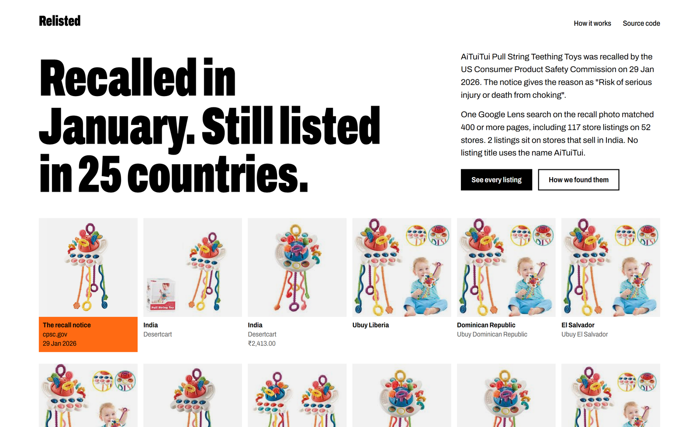

# Relisted

Relisted takes the photo from a US product recall notice, asks Google Lens through SerpApi which pages carry it, and sorts the answer into store listings by country. It also searches the product's name on Google Shopping India, to show what a shopper there finds by name.



Live site: https://tanayvasishtha.github.io/Relisted/

## What it found

The AiTuiTui pull-string teething toy was recalled in the US on 29 January 2026. The notice gives the reason as a risk of serious injury or death from choking, and says it was sold on Amazon. One Lens search on the recall photo matched 400 or more pages, including 117 store listings on 52 stores in 28 countries. Two of those listings are on Desertcart India. No listing title uses the name AiTuiTui. Searched by name, Google Shopping India shows 40 results for the product, from Flipkart, Amazon India, FirstCry and others, and none of them carries the name AiTuiTui.

Across the 43 recalls searched:

| | |
|---|---|
| Recalls with store listings | 26 |
| Recalls with three or more listings | 23 |
| Pages Lens matched | 5,540 |
| Store listings | 1,710 on 453 stores |
| Listings on stores that sell in India | 110, across 18 recalls |
| Pages left out as copies on unrelated sites | 886 |
| Google Shopping India searches by name | 43, showing 1,637 results |
| Recalled names found in none of those results | 23 of the 27 that could be counted |

These figures come from `relisted stats`, which reads the saved results. They are a snapshot from 9 October 2026.

## Why this matters

- An OECD sweep of online shops in 21 economies found that 87% of the banned or recalled products it inspected were still available to buy. [OECD](https://www.oecd.org/en/blogs/2026/03/why-consumer-product-safety-matters-more-than-ever-in-a-global-and-digital-marketplace.html)
- India has no single public recall database, and product safety sits with separate regulators. In February 2026 the consumer regulator fined Snapdeal Rs 5 lakh over toys that broke safety standards, and called reliance on sellers' own declarations inadequate. [ETV Bharat](https://www.etvbharat.com/en/business/snapdeal-fined-rs-5-lakh-for-selling-toys-violating-bis-standards-ccpa-enn26021603866)
- Which? found recalled products on Amazon.com, eBay and Wish, and reporting them as a shopper did not get them removed. [Which?](https://www.which.co.uk/news/article/amazon-com-ebay-and-wish-found-selling-dangerous-recalled-products-aDL7U9y1pbxw)
- In India, toys for children up to 14 must meet Indian Standards and carry the ISI mark under the Toys (Quality Control) Order, 2020. [BIS](https://www.services.bis.gov.in/php/BIS_2.0/BISBlog/toys-quality-control-order/)

## How it works

1. Recalls. The US Consumer Product Safety Commission publishes its recalls as public JSON. No key and no SerpApi search is needed.
2. Priority. Products sold by marketplace sellers come first, then children's products, then fire and battery hazards.
3. Photo. Seller photos sit on a white backdrop, so Relisted picks the notice photo with the whitest border. Photos taken on a lab table are skipped: no store uses them, so Lens can only return other products that look similar.
4. Search by photo. One Google Lens search through SerpApi, with `type=exact_matches`, on that photo.
5. Search by name. One Google Shopping search through SerpApi, with `gl=in`, for the product name in the notice. It counts the results whose title carries the recalled brand. Steps 4 and 5 are the only ones that cost a SerpApi search.
6. Sorting. Rules read each match's address and title and label it a store listing, a shop, a store category page, news, a social post, a copy on an unrelated site, or other. Country comes from the store's address.
7. Trail. For each recall, the listings by country, the stores that sell in India, the name search, what was left out, and links to the raw search results.
8. Act. A recall page with listings on stores that sell in India says where to report it: the National Consumer Helpline (1915), and for toys the BIS Care app. Every recall page offers its listings as a CSV file.

Every search is saved the first time it is paid for and never paid for twice. A credit cap stops any command from spending more than `RELISTED_MAX_CREDITS` searches, and `relisted account` shows what is left. Without a key the program replays the saved searches, so the whole demo runs offline.

## How SerpApi is used

The project uses two engines, and each answers a different question.

- `google_lens` with `type=exact_matches` finds the pages that carry the recall photo. For each match it reads `link`, `source`, `title`, `price` and `thumbnail`. No other public source says which store pages carry a given photo, which is what the project needs.
- `google_shopping` with `gl=in` and `hl=en` shows what a shopper in India gets when they search the product's name. It reads `title` and `source` from about 40 results. Put next to the Lens result, it shows how far a search by name gets in India compared with a search by photo.

A recall costs two searches. The 43 Lens searches and 43 Google Shopping India searches behind this site, plus 6 test searches, make 92 paid in total, out of the 250 a month on the free plan. The raw response for each recall is published under `site/data/raw/`, so any count can be checked against what SerpApi returned. Lens returns at most 400 matches for one photo, and the pages say so where a recall reaches that limit.

## Run it

You need Python 3.10 or newer and [uv](https://docs.astral.sh/uv/).

```
git clone https://github.com/tanayvasishtha/Relisted
cd Relisted
uv sync
uv run relisted serve
```

Open http://127.0.0.1:8000. With no key it shows the saved searches. To search live, copy `.env.example` to `.env` and set `SERPAPI_API_KEY`. The home page then lists recalls that have not been searched, each with a button that runs a Lens search and a Google Shopping India search and opens the result.

To rebuild the results:

```
uv run relisted candidates   # rank recalls and score their photos, free
uv run relisted sweep        # one Lens search per candidate, up to the credit cap
uv run relisted shopping     # one Google Shopping India search per saved recall
uv run relisted rebuild      # sort the saved searches again after a rule change, free
uv run relisted thumbs       # save thumbnails and raw responses for the site, free
uv run relisted stats        # print the numbers above, free
```

Tests and lint: `uv run pytest` and `uv run ruff check .`. Tests never call SerpApi.

## Limits

- A match is a lead. Lens matches the look of a photo. For a product with a distinctive shape, such as the teething toy, the matches are the same toy. For a plain-looking product, such as a pool drain cover or a coin battery, Lens also returns other brands' products. Compare the listing photo with the recall photo before acting.
- A listing can be out of stock or gone by now. The results are a snapshot.
- The country comes from the store's web address. Ubuy and Desertcart run a separate storefront for each country, such as brunei.desertcart.com, which raises country counts. A plain .com or a .eu address does not name one country, so those listings are grouped as country not shown.
- A listing counts as sold in India only when it is a product page on a known store that sells there. An unknown shop with a .in address does not count.
- The reason shown for each recall comes from the recall's title. CPSC's long hazard paragraph is not used, because some records carry another recall's text. Recall 10579, the teething toy, holds the paragraph for the hair-serum recall filed just before it.
- Recalls whose notices only have lab photos are not searched, so the sweep undercounts.
- The recalled-name check uses the first word of CPSC's product name. Words that are ordinary English, such as Magnetic or Little, short words such as GM, and hyphenated descriptions such as Male-to-Male are not counted.
- The name search reads one page of about 40 Google Shopping results, so a seller using the name further down is not seen.
- The sorting rules can be wrong. A small shop can be filed as a copy, and a copy can pass as a shop.

Nothing here says a seller knew about a recall or did anything wrong. The listings are for a person to review.

## Data and licences

Recall notices are US government public data. Listing pages and thumbnails belong to their stores, and are linked and shown small for identification. The Archivo typeface is under the SIL Open Font License. The code is under the MIT licence.

Built for the SerpApi India Hackathon 2026, Knowledge and Public Interest track.
